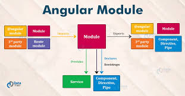

```markdown
# Blog Post Project

This repository contains the HTML code for a simple blog post page that compares two popular frontend frameworks: ReactJs and Angular. The page includes images, bullet points, tables, and hyperlinks. 

## Deployed URL

You can view the live blog post at: [https://shantanu-html-blogpost.onrender.com](https://shantanu-html-blogpost.onrender.com)

## Repository URL

To clone the repository, use the following URL: [https://github.com/ShantanuSrivastava14/BlogPost.git](https://github.com/ShantanuSrivastava14/BlogPost.git)

## Project Overview

The blog post page is structured using HTML tables, images, ordered lists, and unordered lists to present the comparison between ReactJs and Angular. Here are the main sections of the code:

### Header Section

- The page begins with a `<center>` element that centers the title of the blog post.
- The title is placed inside an `<h1>` tag, followed by the author’s name in an `<h3>` tag.

```html
<center>
    <table>
        <tr>
            <td><h1>War of the frameworks</h1></td>
        </tr>
        <tr>
            <td></td>
            <td><h3>- Developer</h3></td>
        </tr>
    </table>
    <br>
    
    <h3>As you might have guessed by now in this blog we will be comparing the two of the most popular frontend frameworks ReactJs and Angular</h3>
</center>
```

### ReactJs Section

- The section on ReactJs starts with an image and a heading inside a table to align them horizontally.
- The details about ReactJs are presented in an ordered list (`<ol>`), with some items containing nested tables to include images.

```html
<center>
    <table>
        <tr>
            <td>
                
            </td>
            <td>
                <h2>&nbsp;&nbsp;&nbsp;&nbsp;&nbsp;&nbsp;ReactJs</h2>
            </td>
        </tr>
    </table>
</center>

<p>
    <ol>
        <li>React.js is a Javascript library for building user interfaces, primarily for web applications.</li>
        <!-- Additional list items here -->
        <li>
            <table>
                <tr>
                    <td>React components can maintain internal state (data that changes over time). When the state changes, React automaticallly re-renders the affected components.</td>
                    <td></td>
                </tr>
            </table>
        </li>
        <!-- More list items here -->
    </ol>
</p>
```

### Angular Section

- Similar to the ReactJs section, the Angular section begins with an image and a heading aligned horizontally in a table.
- Details about Angular are also presented in an ordered list.

```html
<center>
    <table>
        <tr>
            <td></td>
            <td><h2>&nbsp;&nbsp;&nbsp;&nbsp;&nbsp;&nbsp;Angular</h2></td>
        </tr>
    </table>
</center>

<p>
    <ol>
        <li>Angular is a platform and framework for building single-page client applications using HTML, CSS, and TypeScript.</li>
        <!-- Additional list items here -->
        <li>
            <table>
                <tr>
                    <td>Angular applications are organized into modules, which group related components, services, and other code. This modular structure makes the application easier to manage and scale.</td>
                    <td></td>
                </tr>
            </table>
        </li>
        <!-- More list items here -->
    </ol>
</p>
```

### Comparison Table

- A table comparing ReactJs and Angular is included, highlighting their key differences.

```html
<center>
    <h2>Key Differences</h2>
    <table>
        <tr>
            <th>ReactJs</th>
            <th>Angular</th>
        </tr>
        <tr>
            <td>
                <ul>
                    <li>React is a JavaScript library primarily focused on building user interfaces.</li>
                </ul>
            </td>
            <td>
                <ul>
                    <li>Angular is a comprehensive framework for building single-page applications.</li>
                </ul>
            </td>
        </tr>
        <!-- Additional comparison rows here -->
    </table>
</center>
```

### Comments Section

- A comments section at the end of the blog includes some example comments with different users' opinions.

```html
<h2>&nbsp;&nbsp;&nbsp;&nbsp;&nbsp;Comments</h2>
<ul>
    <li><i>Very informative blog. Learned a lot from it.</i></li>
    <p>&nbsp;&nbsp;&nbsp;&nbsp;&nbsp;&nbsp;&nbsp;&nbsp;&nbsp;&nbsp;&nbsp;&nbsp;&nbsp;&nbsp;&nbsp;&nbsp;&nbsp;&nbsp;&nbsp;&nbsp;&nbsp;&nbsp;&nbsp;&nbsp;&nbsp;&nbsp;&nbsp;&nbsp;&nbsp;&nbsp;&nbsp;&nbsp;&nbsp;&nbsp;&nbsp;&nbsp;&nbsp;&nbsp;&nbsp;&nbsp;&nbsp;&nbsp;&nbsp;&nbsp;&nbsp;&nbsp;&nbsp;&nbsp;&nbsp;&nbsp;&nbsp;&nbsp;&nbsp;&nbsp;&nbsp;&nbsp;&nbsp;&nbsp;&nbsp;&nbsp;&nbsp;&nbsp;&nbsp;&nbsp;&nbsp;&nbsp;- anonymous</p>
    <li><i>Great theoretical knowledge but I believe development is all about practical experience and one can only know the best after experimenting with both</i></li>
    <p>&nbsp;&nbsp;&nbsp;&nbsp;&nbsp;&nbsp;&nbsp;&nbsp;&nbsp;&nbsp;&nbsp;&nbsp;&nbsp;&nbsp;&nbsp;&nbsp;&nbsp;&nbsp;&nbsp;&nbsp;&nbsp;&nbsp;&nbsp;&nbsp;&nbsp;&nbsp;&nbsp;&nbsp;&nbsp;&nbsp;&nbsp;&nbsp;&nbsp;&nbsp;&nbsp;&nbsp;&nbsp;&nbsp;&nbsp;&nbsp;&nbsp;&nbsp;&nbsp;&nbsp;&nbsp;&nbsp;&nbsp;&nbsp;&nbsp;&nbsp;&nbsp;&nbsp;&nbsp;&nbsp;&nbsp;&nbsp;&nbsp;&nbsp;&nbsp;&nbsp;&nbsp;&nbsp;&nbsp;&nbsp;&nbsp;&nbsp;- coder1442</p>
</ul>
```

### Contact Information

- The footer section provides contact information and links to the author’s social media profiles.

```html
<center>
    <h3><i>Thanks for visiting my BlogPost project using HTML. In case you liked what you saw, you can contact me through my <strong><a href="mailto:work.shasri@gmail.com">email id</a></strong> or can call or message me at <strong><a href="tel:+917985691707">contact number</a></strong> or have my <a href="https://drive.google.com/file/d/1p6WhSic6XAgbilJriTv1bgtLeNwEVfyo/view?usp=sharing">resume</a> and refer me somewhere for a job.</i></h3>
    <p><i>(just trying to decrease the unemployment rate by getting employed)</i></p>
    <h3><i>Also, don't forget to connect with me on <a href="https://www.linkedin.com/in/shantanu-srivastava-4740a5190/">LinkedIn</a>, <a href="https://github.com/ShantanuSrivastava14">GitHub</a>, and <a href="https://twitter.com/TechVrittikar">X</a></i></h3>
</center>
```

## Learning Outcomes

- **HTML Structure:** Learned to structure a webpage using HTML elements like tables, headings, lists, and images.
- **Tables and Lists:** Gained experience in using tables to organize content and lists to display bullet points and ordered items.
- **Centering Elements:** Practiced centering elements using the `<center>` tag.
- **Embedding Images:** Included and aligned images within the content.
- **Hyperlinks:** Created hyperlinks to email, telephone, and external web pages.

## Conclusion

This project serves as a practical example of creating a structured blog post page using only HTML. It highlights the key differences between ReactJs and Angular and provides a comprehensive overview of each framework’s features and benefits.
```